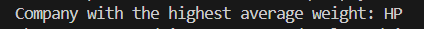
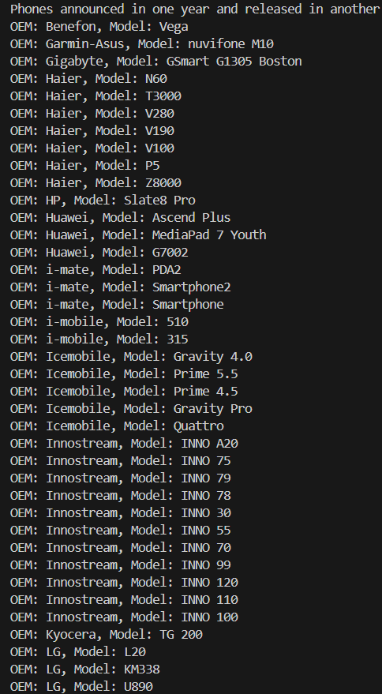
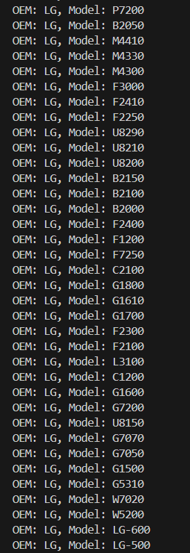
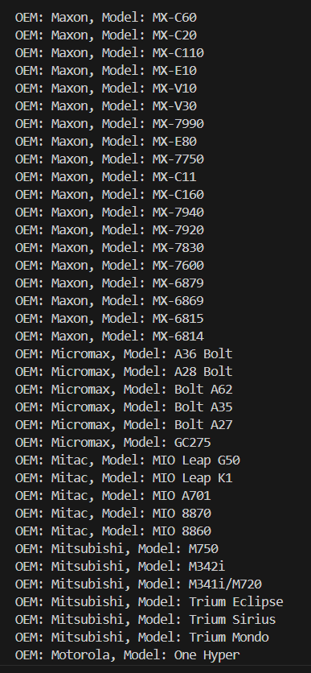
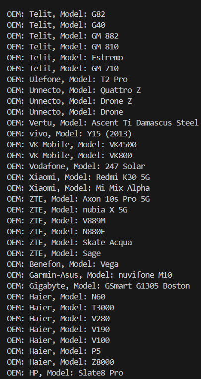

# Alternative-Language-Project

## Programming Language
The programming language I picked for this project is Java, specifically Java 8 or later.

## Why Java?
I picked Java for several reasons. It's a statically-typed, object-oriented language that's widely used in industry, making it a practical choice for many projects. It has robust support for object-oriented programming, with features like classes, interfaces, and inheritance. It also has a large standard library and a rich ecosystem of third-party libraries, which helped a lot in this project.

## How Java handles object-oriented programming, file ingestion, conditional statements, assignment statements, loops, subprograms (functions/methods), unit testing and exception handling.
Java supports object-oriented programming through the use of classes and interfaces. In this project, the Cell class is an example of a Java class. Java classes can have fields (to store state) and methods (to perform actions). They can also inherit from other classes or implement interfaces.

File ingestion in Java can be done using various classes in the java.io and java.nio.file packages. In this project, the FileReader class is used to read a CSV file, and the FileWriter class is used to write to a CSV file.

Java supports conditional statements through if, else if, and else statements, as well as switch statements. Assignment statements in Java use the = operator. Loops can be created using for, while, and do-while statements.

Java supports subprograms through methods. Methods in Java can have parameters, can return a value, and can throw exceptions. In this project, the main method is an example of a Java method.

Unit testing in Java can be done using various frameworks, such as JUnit which is being used for unit testing in this project.

Exception handling in Java is done using try, catch, and finally blocks. Java has checked and unchecked exceptions. Checked exceptions must be declared in the method signature or caught within the method, while unchecked exceptions do not need to be explicitly caught or declared.

## Libraries Used
Three libraries used in this project are Apache Commons Lang, JUnit, and OpenCSV. Apache Commons Lang provides a host of helper utilities for the Java language, enhancing the core Java libraries. JUnit is a widely-used testing framework for Java applications. It provides annotations to identify test methods and contains assertions for testing expected results. OpenCSV is a simple library for reading and writing CSV files in Java. In this project, it's used to read data from a CSV file and write data to another CSV file.

## What company (oem) has the highest average weight of the phone body?

## Was there any phones that were announced in one year and released in another? What are they? Give me the oem and models.
 
 

## How many phones have only one feature sensor?

## What year had the most phones launched in any year later than 1999?

